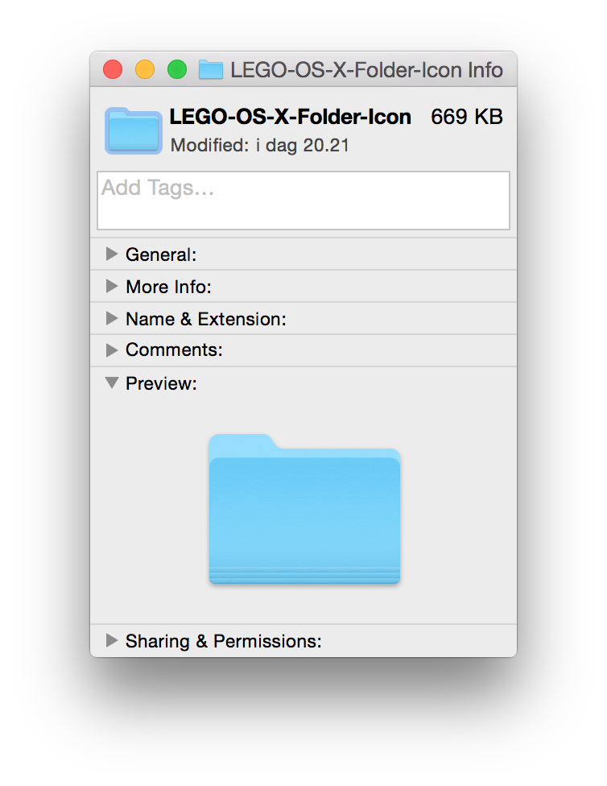
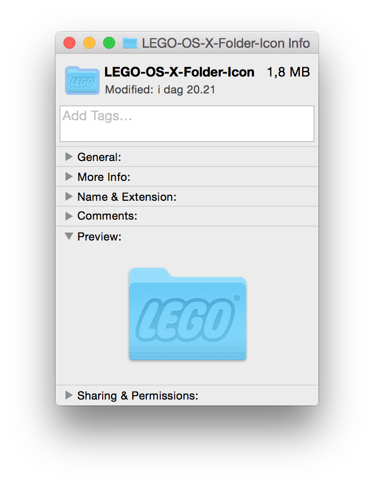

# LEGO OS-X Folder Icon
A folder icon for your LEGO related files.

## Installation
Follow the steps below, you can chose to do it via **Finder** or **Command line**.

### 1. Finder

1. Open `Icon.png` in **Preview.app**
2. `Cmd+a` and `Cmd+c`
3. **Get Info**/`Cmd+i` on the target folder.
4. Select the top left thumbnail.  

5. `Cmd+v` and voilà  

### 2. Command line

Replace **/path/to/folder/** with the target folder.

1. Load `Icon.png` as a resource.  
`sips -i Icon.png`

2. Create resource file.  
`DeRez -only icns Icon.png > Icon.rsrc`

3. Add the resource file to the special `Icon?`/`Icon\r` file.  
`Rez -append Icon.rsrc -o $'/path/to/folder/Icon\r'`

4. Modify the folder to use a custom icon.  
`SetFile -a C /path/to/folder/`

5. Hide the `Icon?` file.  
`SetFile -a V $'/path/to/folder/Icon\r'`

## License
This is released under an MIT license. See LICENSE for more information.
